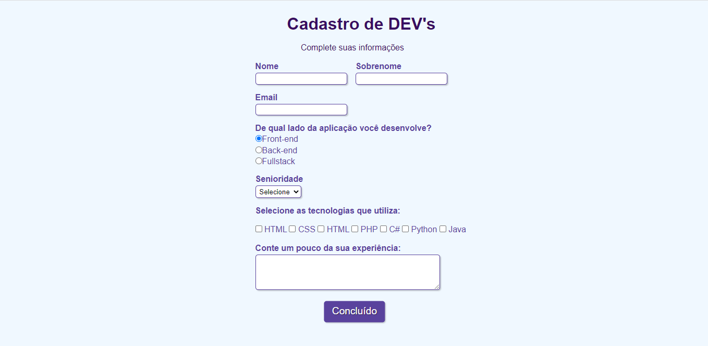

<h2>Olá Mundo! Como vocês estão? 🖖</h2>

Este projeto é de criação de um simples formulário de usuário, com uma temática de cadastro de um desenvolvedor 💻

Para a criação deste formulário, eu utilizei as linguagens:

<li>HTML</li>
<li>CSS</li>
 

Utilizei também o ambiente do VS Code para programar 👾

Aqui está o resultado final! 😄

 

  

Espero que tenham gostado. Até logo 👋
